# + Design docker swarm clusters on Amazon Web Services

    - Getting Started with Amazon EC2 :

    $ login aws

    go to https://console.aws.amazon.com/ec2/v2/home?region=us-east-1
    - launch an instance
    - go to marketplace
    - Next, choose an Amazon Machine Image (AMI)
    - choose Amazon ECS-Optimized Amazon Linux 2 AMI
    - choose t2.micro
    - Next. In Configure Instance Details, specify the number of instances as 1.
    - Select a network or click on Create New VPC to `create a new VPC`.
    - Select a subnet or click on Create New Subnet to create a new subnet.
    - Select Enable for Auto-Assign Public IP. Click on Next.
    - From Add Storage, select the default settings and click on Next
    - In Add Tags, no tags need to be added. Click on Next.
    - From Configure Security Group, add a security group to allow all traffic of any protocol in all port ranges from any source (0.0.0.0/0).
    - Click on Review and Launch and subsequently click on Launch.
    - Select a key pair and click on Launch Instances in the Select an Existing Key Pair or Create a New Key Pair dialog as `EC2` and click on download it.
    - save the key (swarm-cluster.pem)
    - click on see instance

    $ get IPv4 Public IP -> 3.235.222.47

    + SSH login into the EC2 instance as user “ec2-user”.
    $ chmod 400 swarm-cluster.pem # change permissions of swarm-cluster.pem to be read by the command-line
    $ ssh -i "swarm-cluster.pem" ec2-user@3.235.222.47

    # docker start
    $ docker run -d -p 8080:80 --name helloapp tutum/hello-world
    $ docker ps

    $ docker port helloapp # get port of a container
    $ curl localhost:8080

    # check Public DNS (IPv4)
    $ http://ec2-34-203-194-177.compute-1.amazonaws.com:8080/

    $ docker stop helloapp
    $ docker rm helloapp
    4 docker images

    + This section covers the following topics:

        • Setting the environment
        • Initializing the Docker Swarm mode
        • Joining nodes to the Swarm cluster
        • Testing the Swarm cluster
        • Promoting a worker node to manager
        • Demoting a manager node to worker
        • Making a worker node leave the Swarm cluster
        • Making A worker node rejoin the Swarm cluster
        • Making a manager node leave the Swarm cluster
        • Reinitializing a Swarm
        • Modifying node availability
        • Removing a node

    - Tutorial : making a cluster of docker containers -> 1 manager and 2 nodes :

    # swarm mode commands :
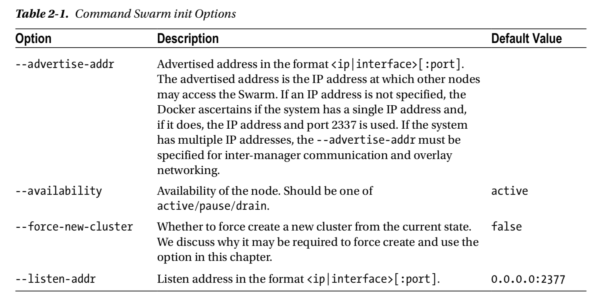

    Run the following command to initialize Docker Swarm mode.
    # check the private ip -> 172.31.66.147
    $ docker swarm init --advertise-addr 172.31.66.147:2377
    $ docker info
    $ docker info | grep Swarm # check weather is active or not.

    $ docker node ls # check how many nodes there is

# Manager Status :
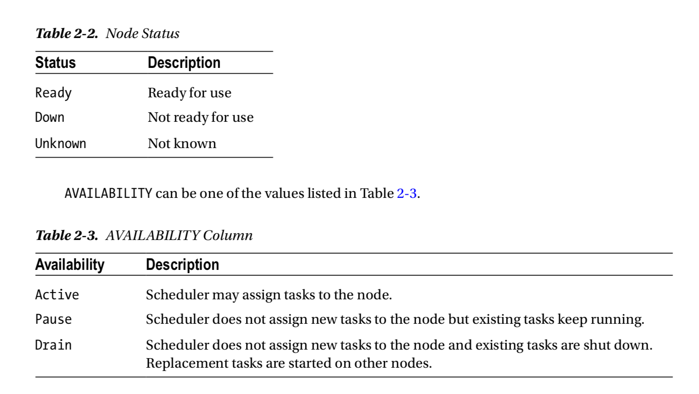
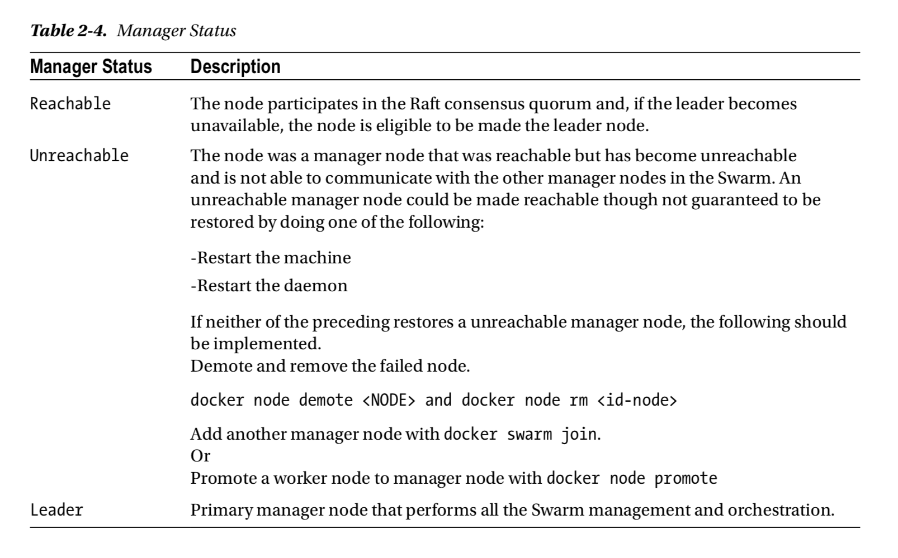

    -> The manager nodes are added for a different reason than the worker nodes. The manager nodes are added
       to make the Swarm more fault tolerant and the worker nodes are added to add capacity to the Swarm.

    The command to add a worker node may also be found using the following command.
    $ docker swarm join-token worker

    The command to add a manager node may be found using the following command.
    $ docker swarm join-token manager

    ++ A reason for adding a worker node is that the service tasks scheduled on some of the nodes are not running and are
       in Allocated state. A reason for adding a manager node is that another manager node has become unreachable.

    # Create EC2 Instances for 1 Manager & 2 Slaves
        Manager -> 3.235.222.47
        Slave-1 -> 3.235.78.101
        Slave-2 -> 3.235.224.114

### + before creating EC2 Instances, we should create a security group where we will allow certains ports :

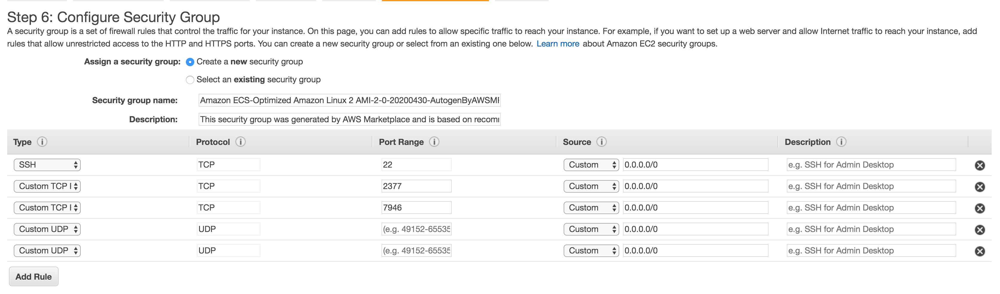

    + Each time you create weather manager or slave choose this security group it's IMPORTANT!!.

    # Add Slaves to the swarm Cluster :
    # Manager :
    $ docker swarm join-token worker # command to get token to add slave nodes

    # Slave 1 :
    $ ssh -i "swarm-cluster.pem" ec2-user@3.235.78.101
    $ docker swarm join --token SWMTKN-1-0z9xm6tcpldjbpergpzkxzeb7oqzoqd9p7lejn1aswipzv4vn7-bmxtfbmd7rsfcuqeyljhbznrn 172.31.66.147:2377

    # Slave 2 :
    $ ssh -i "swarm-cluster.pem" ec2-user@3.235.224.114
    $ docker swarm join --token SWMTKN-1-0z9xm6tcpldjbpergpzkxzeb7oqzoqd9p7lejn1aswipzv4vn7-bmxtfbmd7rsfcuqeyljhbznrn 172.31.66.147:2377

    # Manager
    $ docker node ls

    # create a Docker service using the docker service create command, which becomes available only if the Swarm mode is enabled.
      Using Docker image alpine, which is a Linux distribution, create two replicas and ping the docker.com domain from the service containers.

    $ docker service create --replicas 2 --name helloworld alpine ping docker.com
    $ docker service ls
    $ docker service inspect helloworld
    $ docker service ps helloworld

    # check replicas on slaves nodes :

    # Slave-1
    $ docker ps
        CONTAINER ID        IMAGE               COMMAND             CREATED             STATUS              PORTS               NAMES
        70c80cb48db4        alpine:latest       "ping docker.com"   2 minutes ago       Up 2 minutes                            helloworld.2.79bmb8bvqwnfezaqnxasix000

    # Slave-2
    $ docker ps
        CONTAINER ID        IMAGE                            COMMAND             CREATED             STATUS                           PORTS               NAMES
        f0a29ddbfffa        alpine:latest                    "ping docker.com"   3 minutes ago       Up 3 minutes                                         helloworld.1.wwb4xosfd6y1t9wrsphwyc47a

    -> in the manager node you won't find any docker container.

    # Manager
    $ docker service rm helloworld
    $ docker service inspect helloworld
    []

    # Promoting a Worker Node to Manager
    # Manager
    $ docker node ls
    $ docker node promote ip-172-31-73-139.ec2.internal
    $ docker node ls

        v3vevlzef8jjrpnmgifj94cvg     ip-172-31-73-139.ec2.internal   Ready               Active              Reachable           19.03.6-ce

    # Demoting a Manager Node to Worker
    $ docker node demote ip-172-31-73-139.ec2.internal

    #making a Worker Node Leave the Swarm
    #SALVE-2
    $ docker swarm leave

    # Modifying Node Availability
    $ docker node update --availability drain ip-172-30-5-108.ec2.internal ip-172-30-5-108.ec2.internal

    # update Availability
    $ docker node update --availability drain ip-172-30-5-108.ec2.internal ip-172-30-5-108.ec2.internal

    # Remove a Node
    $ docker node rm ip-172-30-5-108.ec2.internal

### - Using Docker for AWS to Create a Multi-Zone Swarm :

    The Problem
    By default, a Docker Swarm is provisioned on a single zone on AWS, as illustrated in Figure 3-1. With the manager
    nodes and all the worker nodes in the same AWS zone, failure of the zone would make the zone unavailable.
    A single-zone Swarm is not a highly available Swarm and has no fault tolerance.

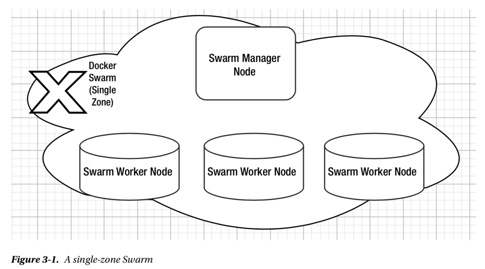

    The Solution
    Docker and AWS have partnered to create a Docker for AWS deployment platform that provisions a Docker
    Swarm across multiple zones on AWS. Docker for AWS does not require users to run any commands on a command
    line and is graphical user interface (GUI) based. With manager and worker nodes in multiple zones,
    failure of a single AWS zone does not make the Swarm unavailable, as illustrated in Figure 3-2.
    Docker for AWS provides fault tolerance to a Swarm.

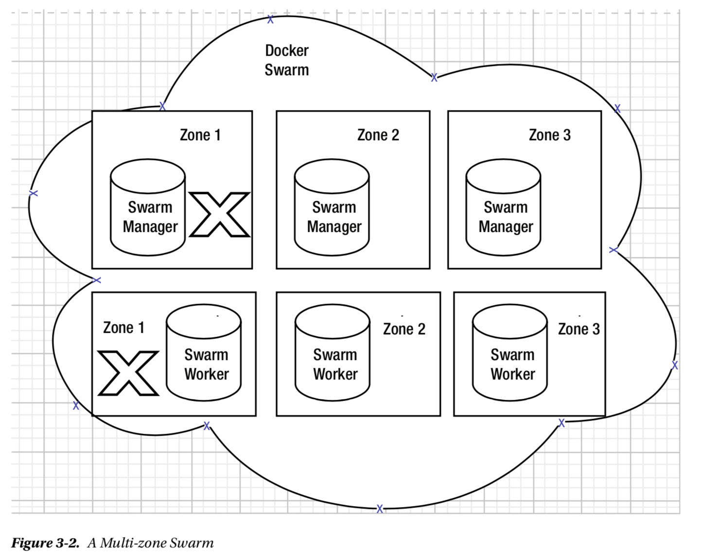

    Docker for AWS has several other benefits:
    • All the required infrastructure is provisioned automatically.
    • Automatic upgrade to new software versions without service interruption.
    • A custom Linux distribution optimized for Docker. The custom Linux distribution is not available separately on AWS and uses the overlay2 storage driver.
    • Unused Docker resources are pruned automatically.
    • Auto-scaling groups for managing nodes.
    • Log rotation native to the host to avoid chatty logs consuming all the disk space.
    • Centralized logging with AWS CloudWatch.
    • A bug-reporting tool based on a docker-diagnose script.

    + Two editions of Docker for Swarm are available:

    • Docker Enterprise Edition (EE) for AWS
    • Docker Community Edition (CE) for AWS

    + We use the Docker Community Edition (CE) for AWS in this chapter to create a multi-zone Swarm.
      This chapter includes the following topics:

    • Setting the environment
    • Creating a AWS CloudFormation stack for the Docker Swarm
    • Connecting with the Swarm manager
    • Using the Swarm
    • Deleting the Swarm

    # Use Docker CE template for CloudFormation to Launch the infrastructure :
    $ http://editions-us-east-1.s3.amazonaws.com/aws/stable/18.03.0/Docker.tmpl

    # go to cloudformation
    # create template
    # add this file in the amazon s3 field : http://editions-us-east-1.s3.amazonaws.com/aws/stable/18.03.0/Docker.tmpl

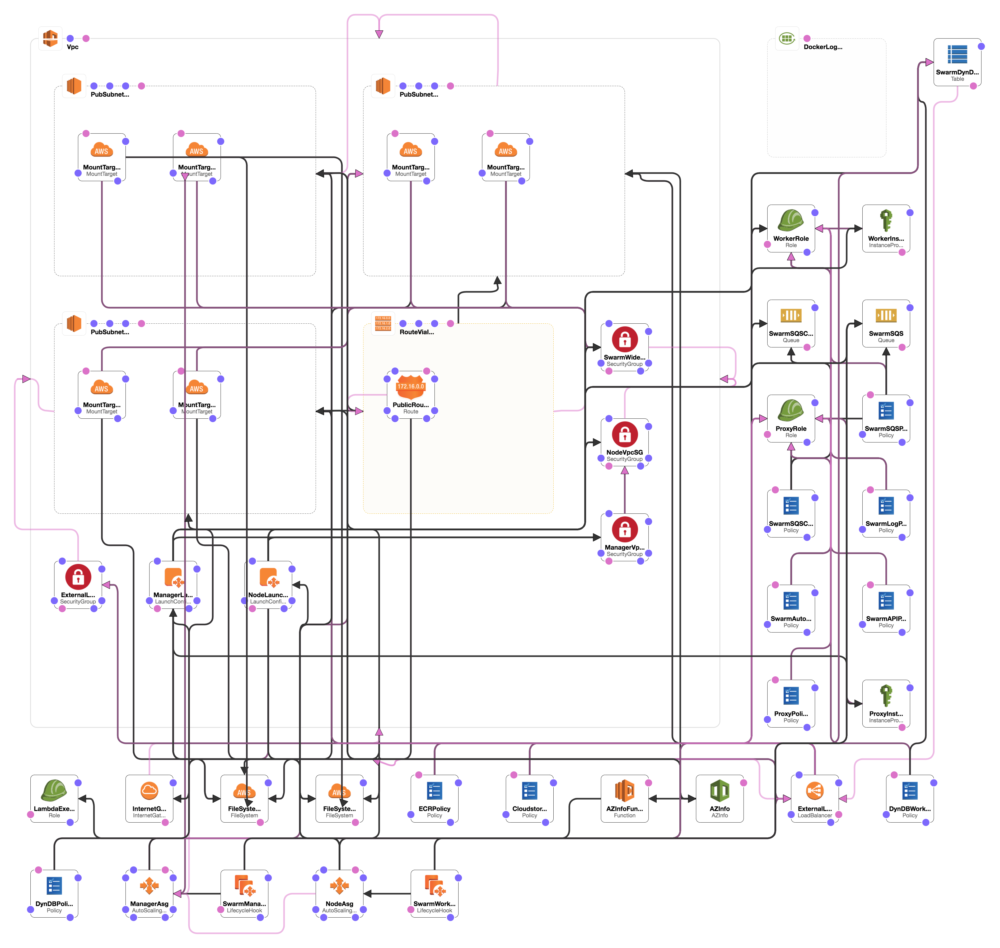

    $ Keep the default settings of 3 for Number of Swarm Managers and 5 for Number of Swarm Worker nodes.

    - Enable daily resource cleanup? -> Cleans up unused images, containers, networks, and volumes. -> no
    - Use Cloudwatch for container logging? -> Send all Container logs to CloudWatch
    - Swarm manager instance type? -> t2.micro
    - Manager ephemeral storage volume size? -> 20GB
    - Manager ephemeral storage volume type? -> standard
    - Set Rollback on Failure to Yes
    - Wait for output to display info
    -> click on docker-swarm-manager

    - check load balancer
    - check launch configuration

    # connecting to swarm cluster - 3 Managers & 5 Workers :
    $ ssh -i "swarm-cluster.pem" docker@3.89.37.51
    $ docker node ls

    $ docker service create \
          --env MYSQL_ROOT_PASSWORD='mysql'\
          --replicas 1 \
          --name mysql \
          --update-delay 10s \
         --update-parallelism 1  \
         mysql

    $ docker service ls

    # scale up docker container
    $ docker service scale mysql=3

    # scale down
    $ docker service scale mysql=0

    # check where each replicas is affected.

    $ docker service ps mysql

    # Updating the Placement Constraints

    # if a replicas failed
    $ docker service ps -f desired-state=running mysql

    # if we want to run a container just in a worker node
    $ docker service update --constraint-add  "node.role==worker" mysql

    # or just a manager node
    $ docker service update --constraint-add 'node.role==manager' mysql

    # update mysql image by a postgres image
    $ docker service update --image postgres mysql

    # Updating resources
    $ docker service update --limit-cpu 0.5  --limit-memory 1GB --reserve-cpu
      "0.5"  --reserve-memory "1GB" mysql

    # check changes
    $ docker service inspect mysql

### - Deleting a Swarm Stack

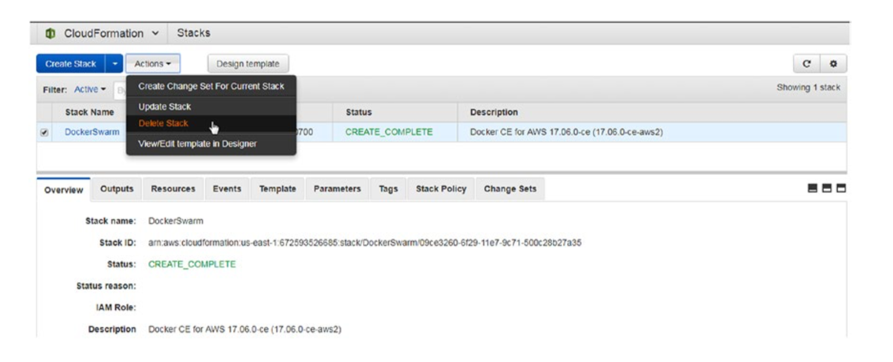

### - Data Persistence - Using Mounts:

    + A service task container in a Swarm has access to the filesystem inherited from its Docker image.
      The data is made integral to a Docker container via its Docker image. At times,
      a Docker container may need to store or access data on a persistent filesystem.
      While a container has a filesystem, it is removed once the container exits.
      In order to store data across container restarts, that data must be persisted
      somewhere outside the container.

    + The Problem :
        Data stored only within a container could result in the following issues:
        • The data is not persistent. The data is removed when a Docker container is stopped.
        • The data cannot be shared with other Docker containers or with the host filesystem.

    + The Solution :
    Modular design based on the Single Responsibility Principle (SRP) recommends that data be decoupled from the Docker container.
    Docker Swarm mode provides mounts for sharing data and making data persistent across a container startup and shutdown.
    Docker Swarm mode provides two types of mounts for services:

    • Volume mounts
    • Bind mounts

    + Volume mounts :

    The default is the volume mount. A mount for a service is created using the --mount option of the
    docker service createcommand.

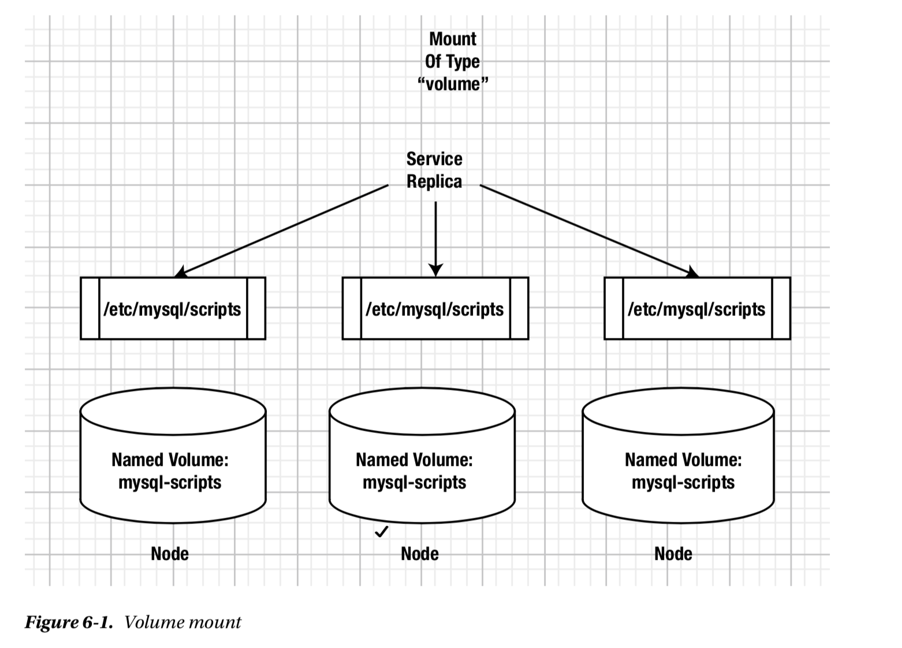

    Each container in the service has access to the same named volume on the host on which the container is running,
    but the host named volume could store the same or different data.
    When using volume mounts, contents are not replicated across the cluster. For example,
    if you put something into the mysql-scripts directory you’re using, those new files will only
    be accessible to other tasks running on that same node. Replicas running on other nodes will not have access to those files.

    + Bind Mounts :

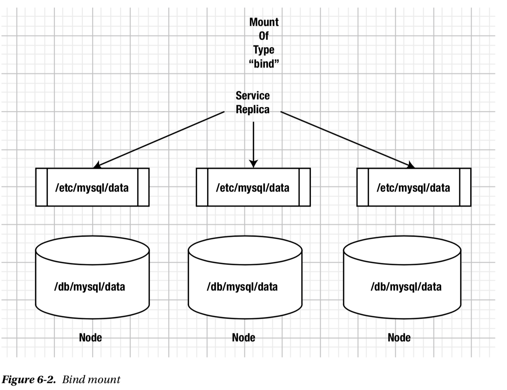

    # Getting Started Volume for database accross swarm :

    $ ssh -i "swarm-cluster.pem" ec2-user@3.235.222.47

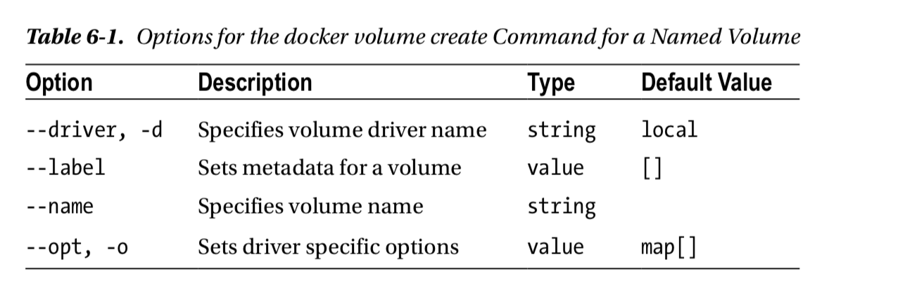

    $ docker volume create --name hello
    $ docker volume ls
    $ docker volume inspect hello

    $ docker service create \
       --name hello-world \
       --mount src=hello,dst=/hello,volume-label="msg=hello",volume-label="msg2=world" \
       --publish 8080:80 \
       --replicas 2 \
       tutum/hello-world

    $ docker service ls
    $ docker service inspect hello-world
         "Mounts": [
                        {
                            "Type": "volume",
                            "Source": "hello",
                            "Target": "/hello",
                            "VolumeOptions": {
                                "Labels": {
                                    "msg": "hello",
                                    "msg2": "world"
                                },
                                "DriverConfig": {}

    $ docker service create \
           --name nginx-service \
           --replicas 3 \
           --mount type=volume,source="nginx-root", \
           destination="/var/lib/nginx", \
           volume-label="type=nginx root dir" \
           nginx:alpine

    $ docker volume ls

    # removing a volume
    $ docker volume rm

    # Creating and Using a Bind Mount
    In this section, we create a mount of type bind. Bind mounts are suitable if data in directories that already
    exist on the host needs to be accessed from within Docker containers.

     - The host source directory and the volume target must both be absolute paths. The host source directory
       must exist prior to creating a service. The target directory within each Docker container of the service
       is created automatically. Create a directory on the manager node and then add a file called createtable.sql to the directory.

    $ sudo mkdir -p /etc/mysql/scripts
    $ cd /etc/mysql/scripts
    /etc/mysql/scripts $ sudo vi createtable.sql
    $ docker service create \
        --env MYSQL_ROOT_PASSWORD='mysql' \
        --replicas 3 \
        --mount type=bind,src="/etc/mysql/scripts",dst="/scripts" \
        --name mysql \
           mysql

    $ docker ps
    $ docker exec -it e71275e6c65c bash
    $ ls -l
      drwxr-xr-x.  2 root root 4096 Jul 24 20:44 scripts

    $ cd /scripts
    $ ls -l
        createtable.sql

    + Configuring resource | Resource Allocation :

    - Problems :

    Two issues can result if no resource configuration is specified in Docker Swarm mode.
    Some of the service tasks could consume a disproportionate amount of resources, while the other service tasks
    are not able to get scheduled due to lack of resources. As an example, consider a node
    with resource capacity of 3GB and 3 CPUs. Without any resource guarantees and limits, one service
    task container could consume most of the resources (2.8GB and 2.8 CPUs), while two other service task
    containers each have only 0.1GB and 0.1 CPU of resources remaining to be used and do not get scheduled,

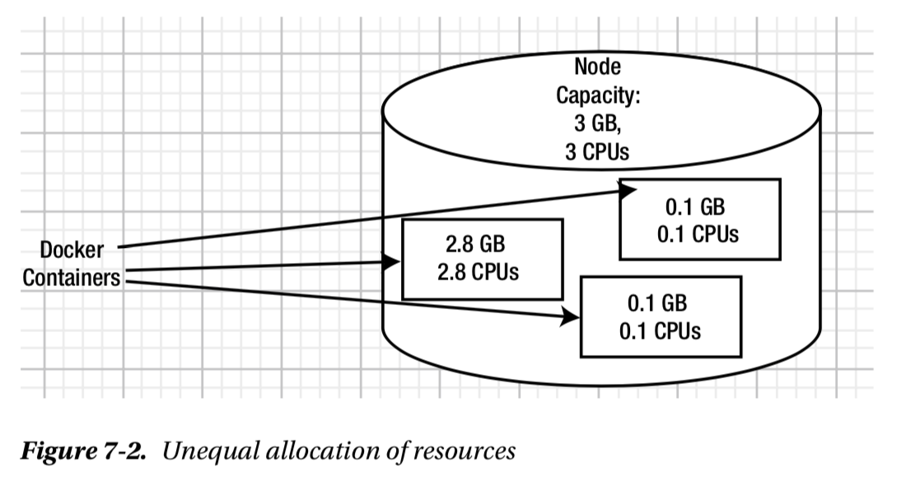

    + The second issue that can result is that the resource capacity of a node can get fully used up without
      any provision to schedule any more service tasks. As an example, a node with a resource capacity of 9GB
      and 9 CPUs has three service task containers running, with each using 3GB and 3 CPUs,

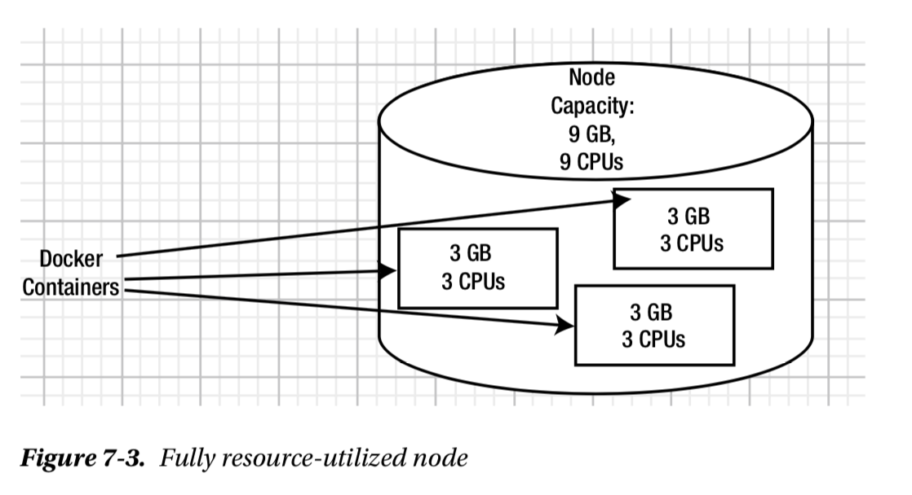

    - Solution :
    A resource limit is the maximum amount of a resource that a service task can use regardless of how much of a resource is available.

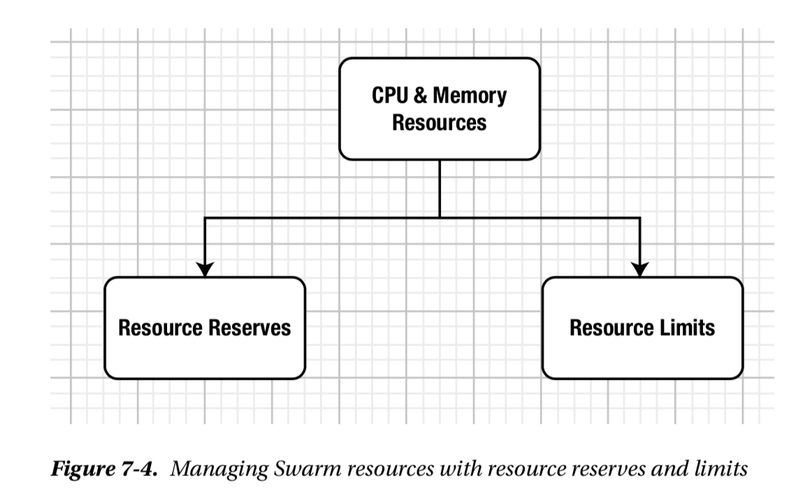

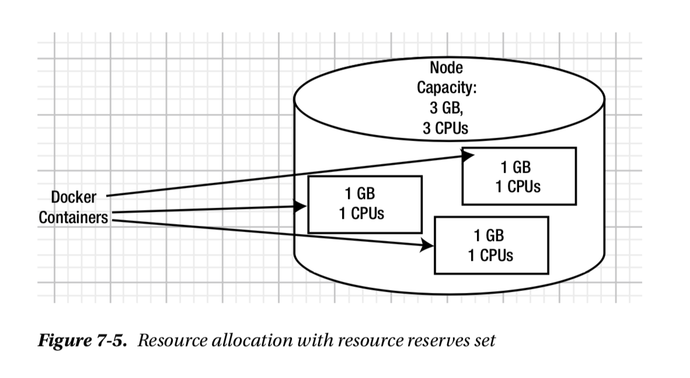

    + And, if resource limits are implemented for service task containers, excess resources would be available to start
      new service task containers. In the example discussed previously, a limit of 2GB and 2 CPUs per service
      task would keep the excess resources of 3GB and 3 CPUs available for new service task containers

    # Create Service Without Resource Specification :

    $    docker service create \
          --env MYSQL_ROOT_PASSWORD='mysql'\
          --replicas 1 \
          --name mysql \
        mysql

    $ docker service ls
    $ docker service ps mysql
    $ docker service inspect mysql
    # Resources Spec are not defined (illimit)
         "Resources": {
                    "Limits": {},
                    "Reservations": {}
                },

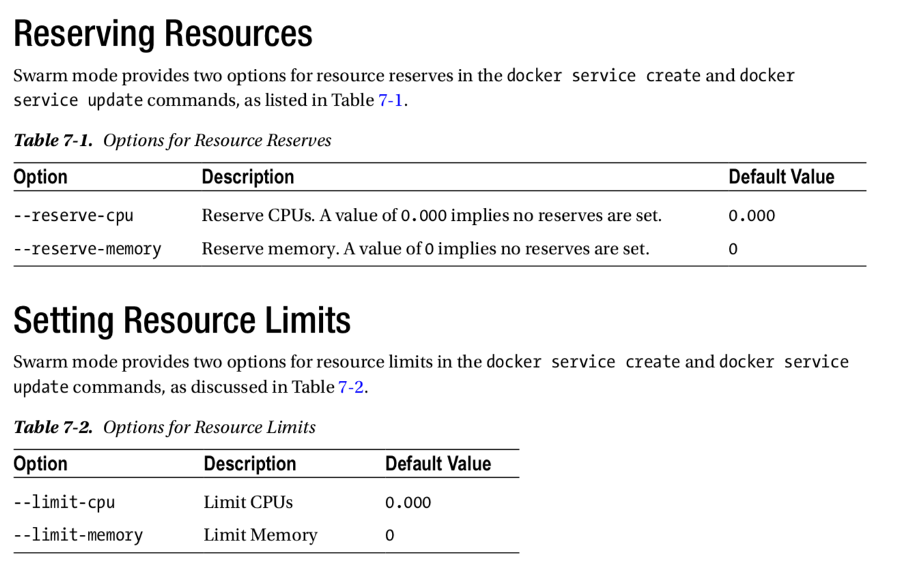

    $ docker service rm mysql

    # create service with resource specification :
    $ docker service create \
        --env MYSQL_ROOT_PASSWORD='mysql'\
        --replicas 1 \
        --name mysql \
      --reserve-cpu .25 --limit-cpu 1 --reserve-memory 128mb --limit-memory 256mb \
       mysql

    $ docker service inspect mysql
        "Resources": {
                    "Limits": {
                        "NanoCPUs": 1000000000,
                        "MemoryBytes": 268435456
                    },
                    "Reservations": {
                        "NanoCPUs": 250000000,
                        "MemoryBytes": 134217728
                    }
                }

    # check node capacities :
    $ docker node ls
    $ docker node inspect ip-172-31-73-139.ec2.internal
        "Resources": {
                "NanoCPUs": 1000000000,
                "MemoryBytes": 1031114752
            }

    # check where mysql service is running
    $ docker service ps mysql

    # scale up mysql container -> see which worker have which container/replicas

    $ docker service scale mysql=5
    $ docker service ps mysql

    # Update resources for a service
    $ docker service update --reserve-cpu 1 --limit-cpu 2 --reserve-memory 256mb

    # Resource Usage and Node Capacity
    $ docker service create \
        --env MYSQL_ROOT_PASSWORD='mysql'\
        --replicas 3 \
        --name mysql \
        --reserve-memory=4GB\
        mysql

    + pay attention to reseve memory to not exced node capacity
    $ docker service ls

    # Another case where we will launch 1 replica and scaling to 3 and failing to scale to 10 :
    $ docker service create \
        --env MYSQL_ROOT_PASSWORD='mysql'\
        --replicas 1 \
      --name mysql \
      --reserve-cpu .5 --reserve-memory 512mb \
       mysql

    $ docker service ls
    $ docker service scale mysql=3
    $ docker service ps mysql
    $ docker service scale mysql=10
    # failing scaling to 10 replicas because of lack of resources.

    + Scheduling :

    - The Problem :
      Without a scheduling policy, the service tasks could get scheduled on a subset of nodes in a Swarm.
      As an example, all three tasks in a service could get scheduled on the same node in a Swarm.

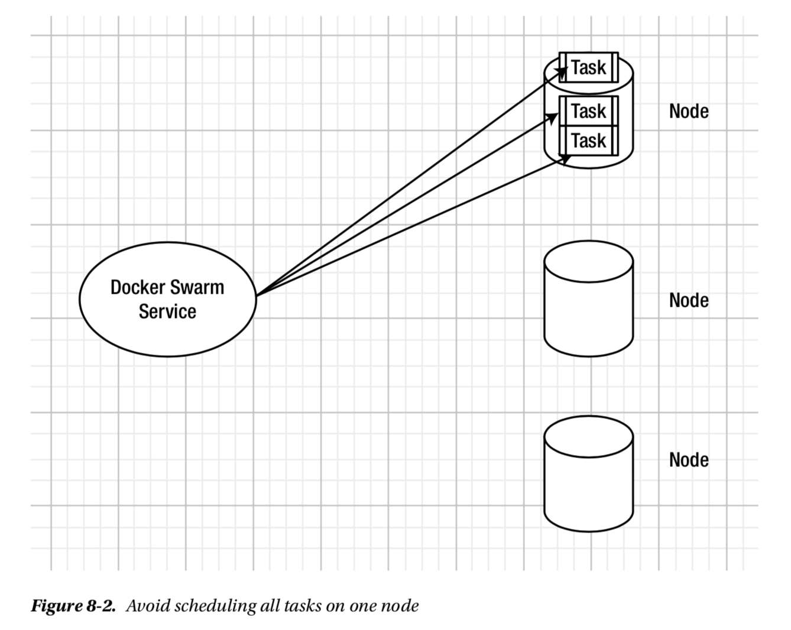

    - Not using a scheduling policy could lead to the following problems:
    • Underutilization of resources in a Swarm—If all the tasks are scheduled on a single node or a subset of nodes,
      the resource capacity of the other nodes is not utilized.
    • Unbalanced utilization of resources—If all the tasks are scheduled on a single node or a subset of nodes,
      the resources on the nodes on which the tasks are scheduled are over-utilized and the tasks could even use up
      all the resource capacity without any scope for scaling the replicas.
    • Lack of locality—Clients access a service’s tasks based on node location. If all the service tasks are scheduled on a single node,
      the external clients that are accessing the service on other nodes cannot access the service locally, thereby incurring a network overhead
      in accessing a relatively remote task.
    • Single point of failure—If all services are running on one node and that node has a problem, it results in downtime.
      Increasing redundancy across nodes obviates that problem.

    - The Solution - Spread Strategy Built-in scheduling in docker swarm :
    To overcome the issues discussed in the preceding section, service task scheduling in a Docker Swarm is based on a built-in scheduling policy.
    Docker Swarm mode uses the spread scheduling strategy to rank nodes for placement of a service task (replica). Node ranking is computed for scheduling
    of each task and a task is scheduled on the node with the highest computed ranking. The spread scheduling strategy computes node rank based on the node's
    available CPU, RAM, and the number of containers already running on the node. The spread strategy optimizes for the node with the least number of containers.
    Load sharing is the objective of the spread strategy and results in tasks (containers) spread thinly and evenly over several machines in the Swarm.

    The expected outcome of the spread strategy is that if a single node or a small subset of nodes go down or become available, only a few tasks are lost and a majority of tasks in the Swarm continue to be available.

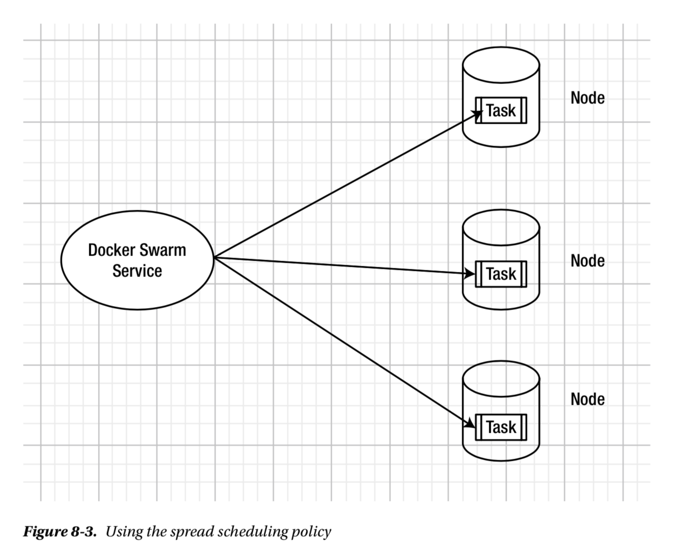

    As a hypothetical example:
    1. Start with three nodes, each with a capacity of 3GB and 3 CPUs and no containers running.

    + scheduling optimization :

        • Setting the environment
        • Creating and scheduling a service—the spread scheduling
        • Desired state reconciliation
        • Scheduling tasks limited by node resource capacity
        • Adding service scheduling constraints
        • Scheduling on a specific node
        • Adding multiple scheduling constraints
        • Adding node labels for scheduling
        • Adding, updating, and removing service scheduling constraints
        • Spread scheduling and global services

    $ docker service create \
        --env MYSQL_ROOT_PASSWORD='mysql'\
        --replicas 5 \
        --name mysql \
         mysql

    $ docker service ls
    $ docker service ps mysql

### - Scheduling Constraints :

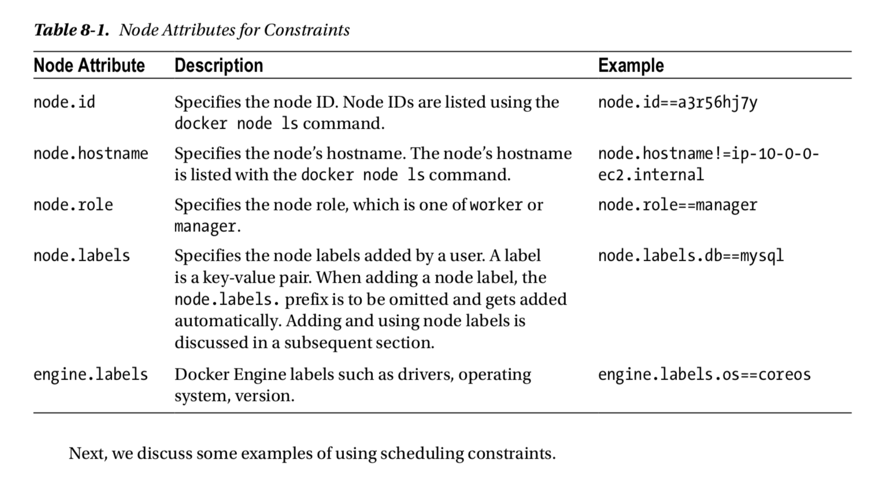

    # scheduling a container in a specific node
    #by kind worker | manager
    $ docker service create \
       --env MYSQL_ROOT_PASSWORD='mysql'\
       --replicas 3 \
       --constraint node.role==worker \
       --name mysql \
       mysql

    $ docker service ps -f desired-state=running mysql

    # By node_id
    $ docker service create \
      --env MYSQL_ROOT_PASSWORD='mysql'\
      --replicas 3 \
      --constraint  node.id ==<nodeid>
      --name mysql \
        mysql

    # Multiple constraints
    $ docker service create \
        --env MYSQL_ROOT_PASSWORD='mysql'\
        --replicas 3 \
        --constraint node.role==worker \
        --constraint   node.hostname!=ip-172-31-2-177.ec2.internal\
        --name mysql \
         mysql

    # promote a node to manager
    $ docker node promote ip-172-31-2-177.ec2.internal

    # Adding Node Labels for Scheduling
    $ docker node update --label-add <LABELKEY>=<LABELVALUE> <NODE>
    $ docker node update --label-add db=mysql ip-172-31-25-121.ec2.internal

    # scheduling a task by lable
    $ docker service create \
        --env MYSQL_ROOT_PASSWORD='mysql'\
        --replicas 3 \
        --constraint node.labels.db==mysql \
        --name mysql \
         mysql

    # delete a label from a node
    $ docker node update --label-rm  db  ip-172-31-25-121.ec2.internal

    # Updating Constraints
    $ docker service update \
      --constraint-add node.role==manager \
      mysql

    $ docker service update \
       --constraint-rm node.role==manager \
       --constraint-add node.role==worker \
       mysql

    $ docker service update --constraint-rm node.role==worker mysql
